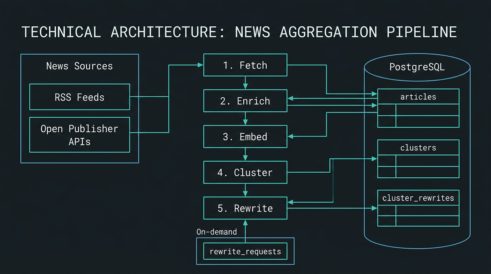

# ARCHITECTURE.md

Technical reference for the Accessible News Aggregator. Update this document when architectural decisions change.

---

## System Overview

A Flask web application that fetches news from RSS feeds and open publisher APIs on a schedule, rewrites each article via Ollama (local LLM) to match a reader's accessibility profile, and presents the result in a clean, accessible reader interface.

The system has no client-side rendering. Flask renders all HTML server-side via Jinja2. HTMX makes targeted requests to Flask routes and swaps HTML fragments into the page. PostgreSQL stores user accounts, fetched articles, clusters, rewritten content, and all configuration.

A five-stage pipeline runs on a background schedule (APScheduler): fetch feeds → enrich (extract full text) → embed → cluster → rewrite. When a user opens the app, content is already ready.

### Pipeline Flow Diagram



| Stage | Component | What it does |
|-------|-----------|--------------|
| 1. Fetch | `app/feed/` | Fetch RSS feeds, parse XML, deduplicate, insert raw articles |
| 2. Enrich | `app/extraction/` | Trafilatura extracts full text from article URLs; updates `articles` |
| 3. Embed | `app/llm/embeddings.py` | Ollama (nomic-embed-text) embeds each article; stores vectors |
| 4. Cluster | `app/clustering/` | Cosine similarity + Union-Find groups related articles into clusters |
| 5. Rewrite | `app/services/rewrite_service.py` | LLM merges cluster articles into one accessible article per profile |

The worker runs on a schedule (fetch every 60 min; enrich at :05; cluster at :15; rewrite daily at 06:00). On-demand rewrites (after setup or settings save) are queued in `rewrite_requests` and processed by the same rewrite stage.

---

## Request Lifecycle

### First-time setup

```
User opens app
    → GET /
    → Flask checks: is user logged in?
    → No: redirect to GET /login (or /register for new users)
    → After login, Flask checks: does this user have a profile?
    → No: redirect to GET /setup
    → Caregiver fills in: location, language, sources, topics, negative news filter, rewrite tone
    → POST /setup → validate, store in PostgreSQL → trigger initial rewrite job → redirect to /
```

### Normal open (content already scheduled)

```
User opens app
    → GET /
    → Flask queries PostgreSQL: get today's articles + cached rewrites for this user's profile_hash
    → Returns full article list immediately — no LLM calls made
    → User sees today's digest with 3-line summaries
```

### New user before first scheduled rewrite

```
User opens app for the first time after completing setup
    → GET /
    → Flask checks: any cached rewrites for this user's profile?
    → No: return page with message "Your articles are being prepared"
    → APScheduler picks up the new user's profile in the next rewrite cycle
    → On next visit (or via HTMX polling), content is ready
```

### Article expansion

```
User taps "Read more"
    → hx-get="/clusters/<cluster_id>/expand"
    → Flask queries PostgreSQL: get cached cluster rewrite for this cluster + profile_hash
    → Returns partials/article_expanded.html with cached content
    → HTMX swaps the partial into #article-{id}
```

---

## Component Map

### `app/feed/`

Responsible for fetching and normalising content from RSS feeds.

For automated source discovery (location-based discovery, feed detection, quality scoring), see `docs/news_source_discovery_agent.md`. The Cursor rule `.cursor/rules/news-source-discovery.mdc` applies when working in this area.

- `fetcher.py` — fetches RSS feeds via HTTP, returns `FetchResult` with content and conditional headers
- `parser.py` — parses feed XML via `feedparser`, returns `RawArticle` objects
- `orchestrator.py` — fetches all due feeds, parses, deduplicates, inserts articles; circuit breaker for failing feeds

A `RawArticle` has: `id`, `title`, `url`, `source`, `published_at`, `raw_text` (RSS description/lede), `full_text` (populated when the source provides full article content).

### `app/llm/`

The LLM abstraction layer. Nothing outside this directory calls Ollama directly.

- `provider.py` — `LLMProvider` abstract base class and `OllamaProvider` implementation
- `embeddings.py` — `EmbeddingProvider` for article clustering; Ollama (nomic-embed-text)
- `prompts/` — prompt template files (`.txt`); `rewrite_cluster.txt` merges multiple articles into one accessible article

### `app/clustering/`

Article clustering by embedding similarity. Groups articles about the same event into clusters.

- `service.py` — embeds articles, clusters by cosine similarity (Union-Find), creates cluster records

### `app/extraction/`

Full-text extraction from article URLs.

- `extractor.py` — batch enrichment for articles with `extraction_status = 'pending'`
- `trafilatura.py` — fetches URL and extracts main body via Trafilatura

### `app/discovery/`

News source discovery: feed detection, validation, quality scoring.

- `feed_detection.py` — validates feed URLs, returns completeness and item count
- `validation.py` — DNS checks, HTTPS validation
- `scoring.py` — quality score from feed completeness, type, frequency, HTTPS

### `app/services/`

Business logic. Routes call services; services do the work.

- `article_service.py` — get today's articles for a user, get digest, expand article
- `profile_service.py` — create/update user profile, compute profile_hash
- `rewrite_service.py` — rewrite articles for a profile, manage cache
- `auth_service.py` — user registration, login, session management

### `app/db/`

All PostgreSQL access. No other module writes to the database directly.

- `articles.py` — read/write for articles (including embeddings, extraction status)
- `clusters.py` — clusters, cluster_articles, cluster_rewrites
- `sources.py` — news_sources, source_feeds, source_discovery_log
- `rewrite_requests.py` — on-demand rewrite queue (setup/settings save)
- `users.py` — read/write for users and profiles
- `admin.py` — admin dashboard queries (job runs, overview stats, feed health, incidents)
- `connection.py` — connection pool management

### `app/routes/`

Flask blueprints. Routes are thin wrappers: parse request, call service, return template.

- `reader.py` — main reader interface (`/`, `/clusters/<id>/expand`)
- `auth.py` — login, register, logout
- `setup.py` — initial configuration wizard (`GET /setup`, `POST /setup`)
- `settings.py` — configuration interface; allows editing profile fields after initial setup
- `admin.py` — admin dashboard (`GET /admin`, `GET /admin/partials/jobs`); requires `is_admin`

### `app/templates/`

Jinja2 templates. Pages extend `base.html`. HTMX responses use partials. Templates live at project root `templates/`, not under `app/`.

```
templates/
├── base.html               # Shell: nav, font settings; contains inline <script> for Web Speech API TTS only
├── index.html              # Main reader view (today's digest)
├── login.html              # Login page
├── register.html           # Registration page
├── setup.html              # Initial configuration wizard
├── settings.html           # Settings page
├── admin/
│   ├── dashboard.html      # Admin dashboard (pipelines, jobs, users, incidents)
│   └── partials/
│       └── jobs.html      # Job runs table (HTMX partial, auto-refresh)
└── partials/
    ├── article_card.html   # Summary card (one cluster in list)
    ├── article_expanded.html  # Full simplified article
    ├── feed_content.html   # Feed list, loading state, or empty state
    ├── setup_sources.html  # Source selection section for setup
    └── setup_topics.html   # Topic selection section for setup
```

---

## Configuration

All config lives in `config/`. The app reads it at startup. No config is hardcoded.

### `config/app.yaml`

```yaml
llm:
  provider: ollama
  model: qwen2.5:7b
  host: http://ollama:11434

embeddings:
  provider: ollama
  model: nomic-embed-text
  host: http://ollama:11434

schedule:
  fetch_interval_minutes: 60
  enrichment_cron: "5 * * * *"
  cluster_cron: "15 * * * *"
  rewrite_cron: "0 6 * * *"
  rewrite_batch_size: 10
  rewrite_parallel_workers: 1
  fetcher:
    circuit_breaker_threshold: 5
    request_timeout_seconds: 30
    user_agent: "AccessibleNewsAggregator/0.1 (+https://github.com/accessible-news/aggregator)"

extraction:
  enabled: true
  min_content_length: 200
  batch_size: 30
  rate_limit_per_domain: 2.0
  timeout: 30

processing:
  articles_per_day: 10
  summary_sentences: 3
  rewrite_max_tokens: 2000
  cluster_window_hours: 24
  cluster_similarity_threshold: 0.82
  embed_batch_size: 50

relevance:
  weights:
    recency: 0.20
    coverage: 0.35
    topic_affinity: 0.20
    source_affinity: 0.15
    content_quality: 0.10
  recency_half_life_hours: 8
  coverage_cap: 4
  min_sources: 2

server:
  port: 5000
  debug: false
```

> **Note:** `SECRET_KEY` is loaded directly from the environment (`.env`) by the Flask app factory — not via `app.yaml`. YAML is for non-secret config only.

### `config/sources.yaml`

Defines the catalog of available sources and their metadata. Each source should include a `topics` list. User selections are stored in PostgreSQL via the setup wizard and settings page.

```yaml
sources:
  - id: "3cat"
    name: "3Cat Notícies"
    domain: "www.3cat.cat"
    homepage_url: "https://www.3cat.cat/"
    country_code: "ES"
    region: "Catalonia"
    languages: ["ca"]
    topics: ["general"]
    full_text: true
    feeds:
      - url: "https://www.3cat.cat/rss/noticia/catala/rss.xml"
        type: rss
        label: main

  - id: "elcritic"
    name: "El Crític"
    domain: "www.elcritic.cat"
    homepage_url: "https://www.elcritic.cat/"
    country_code: "ES"
    region: "Catalonia"
    languages: ["ca"]
    topics: ["politics", "society"]
    full_text: true
    feeds:
      - url: "https://www.elcritic.cat/feed"
        type: rss
        label: main
```

---

## LLM Processing Detail

### Cluster rewrite prompt (reference)

The system uses `rewrite_cluster.txt` to merge multiple articles about the same event into one well-written article for a general audience. Variables: `{language}`, `{rewrite_tone}`, `{filter_negative}`, `{summary_sentences}`, `{articles_text}`.

Output format (exact headers required):

```
TITLE:
One headline.

SUMMARY:
{summary_sentences} plain sentences.

FULL:
Full article (style follows rewrite_tone).
```

When `filter_negative` is enabled, the prompt instructs the LLM to omit or soften distressing content. The negative filter is applied at rewrite time via the LLM prompt — not by keyword list or pre-filtering. It is a soft filter; the LLM exercises judgement.

### `rewrite_tone` valid values

The `rewrite_tone` field is a short freeform instruction string included verbatim in the LLM prompt. Recommended values (enforce via the setup wizard dropdown):

| Value (stored in DB) | Label shown to user |
|---|---|
| `Journalistic style. Formal and well-written. Do not simplify; preserve original complexity and nuance. Avoid spoilers in headlines or summaries.` | Neutral (default) |
| `Short sentences. Simple vocabulary. No jargon.` | Simple |
| `Very short sentences. One idea per sentence. Elementary vocabulary.` | Very simple |
| `Short sentences. Calm, reassuring tone. Avoid alarming phrasing.` | Calm |
| `Short sentences. Formal but clear. Avoid colloquialisms.` | Formal |

Store and pass the full instruction string, not a code name. The LLM prompt uses it directly. The default is `Journalistic style. Formal and well-written. Do not simplify; preserve original complexity and nuance. Avoid spoilers in headlines or summaries.`

### Rewrite scheduling

**Active user definition:** A user is considered active for the daily rewrite job if they have completed the setup wizard (i.e., `user_profiles` row exists for that `user_id`) AND their account `is_active = TRUE`. No recency requirement — every user with a complete profile gets fresh rewrites daily. This means LLM cost scales with the number of registered, setup-complete accounts, not just recent logins.

The daily rewrite job (APScheduler):

1. Collects all distinct rewrite profiles (profile hashes from users with complete setup)
2. For each profile hash, finds clusters needing rewrite (within the cluster window)
3. For each cluster, merges articles via LLM and stores in `cluster_rewrites`
4. On-demand rewrites (after setup/settings save) are queued in `rewrite_requests`; the worker polls and processes them

Two users with the same profile hash share cached rewrites — the LLM is never called twice for the same cluster + profile combination.

### Daily digest delivery

The daily digest is an **in-app experience only**. There is no email or push notification in the MVP. When a user opens the app after the rewrite job has run, they see a badge or banner: "N new articles since your last visit." This is rendered server-side from the `cluster_rewrites` table — no service worker, no push API.

The badge is visible to all users of the account. Any person who has access to the account can check it from any device without special notification setup.

### Language and source mismatch

If a user sets `language = "en"` but selects Catalan-language sources, the LLM rewrites the article **in the user's configured language** (English), effectively translating it. The rewrite prompt always specifies the target language. There is no pre-filtering by source language.

Caregivers should be aware of this during setup: the setup wizard should display each source's language so they can make an informed selection. Cross-language selections are allowed; translation is automatic.

---

## Operational Rules

### Admin dashboard

Operators can monitor the system at `/admin`. Access requires `is_admin = true` on the user account. Grant via `flask make-admin <email>`. The dashboard shows job run history, feed health, article pipeline stats, clustering coverage, user activity, and auto-detected incidents. See [docs/ADMIN_DASHBOARD.md](ADMIN_DASHBOARD.md).

### APScheduler and Gunicorn workers

**Hard rule:** APScheduler must only run in the `scheduler` container (entrypoint: `python -m app.scheduler`). It must never be imported or started inside the `web` container.

If APScheduler is started inside a Gunicorn process, every worker spawns its own scheduler, causing every scheduled job to run N times (where N = number of workers). This causes duplicate fetches, duplicate rewrites, and duplicate LLM charges.

- The `web` container runs `gunicorn` only — no scheduler import, no `scheduler.start()` call anywhere in the Flask app factory or any module it imports at startup.
- The `scheduler` container imports and starts APScheduler in `app/scheduler.py` (the `__main__` module), which is a separate process that never handles HTTP requests.
- Do not add `scheduler.start()` to `create_app()` or any Flask init code, even for convenience during development.

---

## What This System Is Not

- Not a scraper. It uses RSS and official APIs.
- Not a republisher. Every article links to and credits the original source.
- Not a single-page application. There is no client-side routing.
- Not cloud-dependent for LLM. It uses Ollama (local) — no API key required; runs fully offline after models are pulled.
